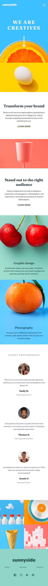
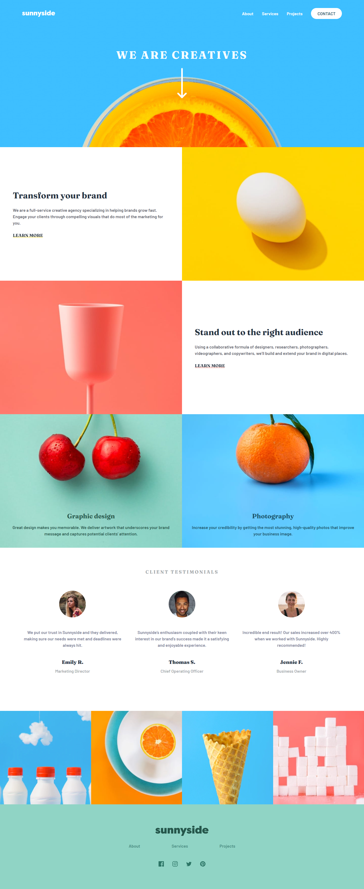

# Sunnyside agency landing page

## Table of contents

- [Overview](#overview)
  - [The challenge](#the-challenge)
  - [Screenshot](#screenshot)
  - [Links](#links)
- [My process](#my-process)
  - [Built with](#built-with)
  - [What I learned](#what-i-learned)
  - [Useful resources](#useful-resources)
- [Author](#author)
- [Acknowledgments](#acknowledgments)

## Overview

### The challenge

Users should be able to:

- View the optimal layout for the site depending on their device's screen size
- See hover states for all interactive elements on the page

### Screenshot

  
  

### Links

- Live Site URL: [Sunnyside landing page](https://inspiring-halva-1dfbc3.netlify.app)

## My process

### Built with

- Semantic HTML5 markup
- CSS custom properties
- Flexbox
- CSS Grid
- Mobile-first workflow
- BEM Methodology

### What I learned

While I was working through this project I learned to work with custom properties that is a great way to write some cool css code because is helpfully to edit faster something like colors, fonts, etc.

I also learned how to use BEM Methodology which helps to write a better structur to html and css.

```html
<!--BEM Methodology -->
<section class="services">
      <div class="services__image service__img--1"></div>
      <div class="services__texts">
        <h2 class="services__title">Transform your brand</h2>
        <p class="services__paragraph">We are a full-service creative agency specializing in helping brands grow fast. 
          Engage your clients through compelling visuals that do most of the marketing for you.
        </p>
        <a href="#" class="services__cta">Learn more</a>
      </div>

      <div class="services__image service__img--2"></div>
      <div class="services__texts services__texts--2">
        <h2 class="services__title">Stand out to the right audience</h2>
        <p class="services__paragraph">Using a collaborative formula of designers, researchers, photographers, videographers, and copywriters, we’ll build and extend your brand in digital places. 
        </p>
        <a href="#" class="services__cta">Learn more</a>
      </div>
    </section>
```

```css
/*Custom Properties*/
:root {
  /* colores primarios */
  --soft-red: hsl(7, 99%, 70%);
  --yellow: hsl(51, 100%, 49%);
  --dark-desaturated-cyan: #25564b;

  /*Fuentes */
  --font1: 'Barlow', sans-serif;
  --font2: 'Fraunces', serif;
}
```
<!--
```js
const proudOfThisFunc = () => {
  console.log("🎉");
};
```
-->

### Useful resources

- [BEM Methodology](https://www.youtube.com/watch?v=YaAkV--25fg&t=192s) - This helped me write more readable css and html code. I really liked this methodology and will use it going forward.
- [BEM Methodology](https://getbem.com/introduction/) - This is an amazing article which helped me finally understand BEM methodology. I'd recommend it to anyone still learning this concept.
- [Custom Properties](https://developer.mozilla.org/en-US/docs/Web/CSS/Using_CSS_custom_properties) - This article helped me to understood how to write custom properties and its sctructure.

## Author
|  [<br><sub>Javier Hernández</sub>](https://github.com/Javilh97)  |
| :---: |

<!--- Website - [Add your name here](https://www.your-site.com)-->
<!--- Frontend Mentor - [@yourusername](https://www.frontendmentor.io/profile/yourusername)-->
<!--- Twitter - [@yourusername](https://www.twitter.com/yourusername)-->

## Acknowledgments


